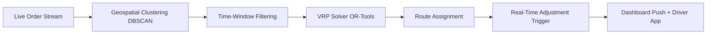

# 📘 LogiFood: Complete Build Guide for a Swiggy MCP-Native B2B Delivery Optimization SaaS

This guide provides a **step-by-step, production-ready blueprint** to build LogiFood from scratch. It assumes you are a solo founder or small team targeting Tier 2/3 Indian cities, leveraging logistics background, Swiggy Builders Club access, and free/low-cost tooling. The roadmap is structured into **7 phases** spanning ~12 weeks, with exact tech choices, API integration patterns, algorithm logic, compliance guardrails, and traction metrics.

---

## 🧭 Phase 1: Validation & Problem Scoping (Days 1–7)
**Goal:** Confirm the pain point, baseline metrics, and willingness to pay before writing code.

| Action | Details |
|---|---|
| **Target Businesses** | 5–10 cloud kitchens, dark stores, or multi-outlet F&B brands in Bhubaneswar/Ranchi |
| **Discovery Questions** | • Avg delivery time & cost/order?<br>• % of SLA breaches during peak?<br>• How are drivers currently routed?<br>• Would you pay ₹3k–₹8k/mo for 15%+ time/cost reduction? |
| **Baseline Metrics to Track** | `Orders/day`, `Avg delivery time`, `Failed attempts`, `Driver idle time`, `Cost/order` |
| **Output** | 1-page validation doc + signed LOIs from 2–3 pilot kitchens |

> ✅ **Founder Tip:** Offer a **free 14-day parallel tracking** (run your logic alongside their current process). This builds trust and generates comparative data for your pitch.

---

## 🏗️ Phase 2: System Architecture & Tech Stack (Days 8–14)
**Goal:** Set up a scalable, low-cost, production-ready stack.

```text
[User Dashboard] → Next.js (Vercel)
       ↓
[Backend API] → Python FastAPI / Node.js Express (Render/AWS)
       ↓
[DB & Auth] → Supabase (PostgreSQL + Row-Level Security)
       ↓
[AI/Agent Layer] → AWS Bedrock + AgentCore (LangChain/LlamaIndex compatible)
       ↓
[Swiggy MCP] → Food & Instamart Servers (35+ tools via MCP SDK)
       ↓
[Routing Engine] → OSRM (self-hosted) + Google OR-Tools
```

| Component | Tool | Why |
|---|---|---|
| **Frontend** | Next.js 14 + Tailwind + Mapbox GL + Recharts | SSR, SEO, real-time maps, low bundle size |
| **Backend** | FastAPI (Python) | Native async, easy OR-Tools integration, MCP agent hosting |
| **Database** | Supabase | Free tier, Row-Level Security, real-time webhooks, auth |
| **AI Agent** | AWS Bedrock (Claude 3 Haiku/Sonnet) + AgentCore | Tool-calling, multi-step orchestration, rate-limit aware |
| **Routing** | OSRM (OpenStreetMap Routing Machine) + OR-Tools | Free, self-hostable, industry-standard VRP solver |
| **Hosting** | Vercel (FE) + Render (BE) + Supabase (DB) | $0–$20/mo for MVP, auto-scaling, CI/CD ready |

> ⚠️ **MCP Note:** Swiggy Builders Club exposes functionality via **MCP servers**, not traditional REST. You'll interact using an MCP-compatible client (e.g., `langchain-mcp`, `llama-index-mcp`, or Swiggy's provided SDK). All calls are stateless, tool-based, and rate-limited.

---

## 🔌 Phase 3: Swiggy Builders Club Integration (Days 15–25)
**Goal:** Authenticate, ingest real-time order data, and map it to your internal schema.

### 1. Application & Access
- Apply at `mcp.swiggy.com/builders` with pitch: `"AI-native delivery clustering SaaS for Tier 2/3 cloud kitchens"`
- Upon approval, receive: `MCP_ENDPOINT`, `API_KEY`, `RATE_LIMITS`, `SDK/Docs`

### 2. MCP Client Setup (Python Example)
```python
# Install: pip install mcp-client langchain-mcp
from mcp import Client
from langchain_mcp import MCPTool

swiggy_mcp = Client(
    endpoint="https://mcp.swiggy.com/v1/builders",
    api_key=os.getenv("SWIGGY_MCP_KEY")
)

# Load tools
tools = swiggy_mcp.list_tools()  # Returns 35+ tools across Food/Instamart/Dineout
```

### 3. Core Tools You'll Use
| Swiggy MCP Tool | Purpose | Your Mapping |
|---|---|---|
| `search_restaurants` | Find nearby kitchens | Cluster radius definition |
| `get_active_orders` | Real-time order stream | Input for VRP solver |
| `get_delivery_eta` | Live tracking | SLA breach prediction |
| `update_driver_status` | Assign routes | Dispatch panel |
| `suggest_cart_cluster` | Custom MCP agent hook | Clustering logic |

### 4. Data Flow & Rate Limit Handling
- **Polling vs Webhooks:** Swiggy MCP may not support webhooks natively. Use **exponential backoff polling** (every 15–30s during peak).
- **Caching:** Cache restaurant metadata & zone boundaries in Supabase. Only fetch dynamic order data.
- **Fallback:** If rate-limited, switch to cached last-state + predictive ETA until quota resets.

> ✅ **Compliance Guardrail:** Do not store direct PII. Prefer location coordinates (`lat`, `lng`) and order IDs only. Log all MCP calls for audit.

---

## 🧠 Phase 4: Routing & Clustering Engine (Days 26–40)
**Goal:** Build the core algorithm that clusters orders, optimizes routes, and dynamically adjusts.

### 1. Problem Formulation
You're solving a **Dynamic Vehicle Routing Problem with Time Windows (DVRP-TW)**:
- Inputs: Restaurant location, customer locations, order timestamps, fleet size, max delivery time
- Constraints: Driver capacity, SLA windows, traffic zones, peak-hour surges
- Output: Optimized route per driver, ETA, cluster assignment

### 2. Algorithm Pipeline


### 3. Implementation (Python + OR-Tools)
```python
from ortools.constraint_solver import pywrapcp, routing_enums_pb2
import numpy as np

def solve_vrp(orders, depot, vehicle_count, max_time_min=30):
    manager = pywrapcp.RoutingIndexManager(len(orders) + 1, vehicle_count, 0)
    routing = pywrapcp.RoutingModel(manager)

    def distance_callback(from_idx, to_idx):
        # Replace with actual OSRM distance matrix
        return int(np.linalg.norm(orders[from_idx] - orders[to_idx]) * 100)

    transit = routing.RegisterTransitCallback(distance_callback)
    routing.SetArcCostEvaluatorOfAllVehicles(transit)

    # Time window constraints
    time = "Time"
    routing.AddDimension(transit, 0, max_time_min * 60, True, time)
    time_dimension = routing.GetDimensionOrDie(time)

    for i, loc in enumerate(orders):
        idx = manager.NodeToIndex(i + 1)
        time_dimension.CumulVar(idx).SetRange(0, max_time_min * 60)

    search_params = pywrapcp.DefaultRoutingSearchParameters()
    search_params.first_solution_strategy = routing_enums_pb2.FirstSolutionStrategy.PATH_CHEAPEST_ARC
    search_params.local_search_metaheuristic = routing_enums_pb2.LocalSearchMetaheuristic.GUIDED_LOCAL_SEARCH
    search_params.time_limit.seconds = 10

    solution = routing.SolveWithParameters(search_params)
    return extract_routes(solution, routing, manager, orders)
```

### 4. Real-Time Adjustment
- Use **Supabase Edge Functions** to listen to new `orders` inserts
- Trigger incremental re-optimization only for affected clusters (not full re-solve)
- Fallback to nearest-neighbor heuristic if solver timeout > 5s

> ✅ **LoadSaathi Synergy:** Apply freight consolidation rules: avoid backhaul, prioritize high-density pin codes, group orders by kitchen zone, and apply dynamic driver load balancing.

---

## 🖥️ Phase 5: Dashboard & UX (Days 41–55)
**Goal:** Deliver a clean, actionable B2B interface for kitchen managers and dispatchers.

### Core Screens
| Screen | Features | Tech |
|---|---|---|
| **Live Ops Map** | Real-time order pins, driver routes, cluster boundaries, SLA countdown | Mapbox GL + WebSocket |
| **Dispatch Panel** | Drag-and-drop driver assignment, route preview, ETA override | React DnD + Zustand |
| **Analytics** | Cost/order, avg delivery time, breach %, driver utilization | Recharts + Supabase aggregates |
| **Settings** | Fleet size, delivery radius, peak rules, alert thresholds | React Hook Form + Zod validation |

### Key Implementation Details
- **Real-time Sync:** Supabase `Realtime` subscriptions for order status changes
- **Performance:** Virtualize maps for >500 pins, debounce API calls, cache static zone data
- **Security:** Supabase RLS, JWT auth, encrypted API keys, audit logs for all dispatch actions

> ✅ **UX Principle:** Keep it **manager-first**. Dispatchers need <3 clicks to reassign, <2s to load routes, and clear visual SLA warnings.

### Expected Outcomes (Benchmark)
| Metric | Baseline | LogiFood Target |
|---|---|---|
| Avg Delivery Time | 38 min | 26–28 min (-25%) |
| Cost/Order | ₹42 | ₹32–35 (-20%) |
| SLA Breach Rate | 18% | <6% |
| Driver Utilization | 62% | 78%+ |

### Feedback Loop
- Daily 10-min sync with kitchen managers
- Log UI friction, algorithm edge cases, and Swiggy rate-limit hits
- Iterate: adjust cluster radius, tweak time windows, add manual override flags

> ✅ **Compliance Check:** Ensure all Swiggy MCP usage aligns with Builder Club ToS. Do not resell raw data. Provide only aggregated insights and routing suggestions.

---

## 🛡️ Critical Guardrails & Risk Mitigation
| Risk | Mitigation |
|---|---|
| **Swiggy API Rate Limits** | Implement token bucket queue, cache static data, fallback to heuristic solver |
| **Data Privacy Compliance** | Avoid direct PII, store only `lat,lng,order_id`, run Supabase RLS, log all MCP calls |
| **Algorithm Overfitting** | Use rolling 30-day training window, A/B test cluster radius, manual override allowed |
| **B2B Sales Friction** | Offer 14-day parallel tracking, ROI calculator, case study PDF after pilot |
| **MCP Deprecation** | Build abstraction layer over Swiggy SDK, maintain fallback REST mock for testing |
